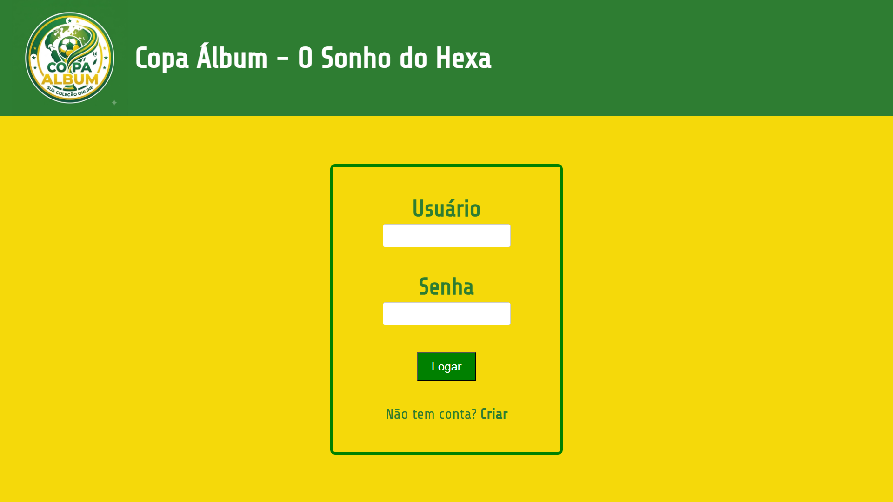
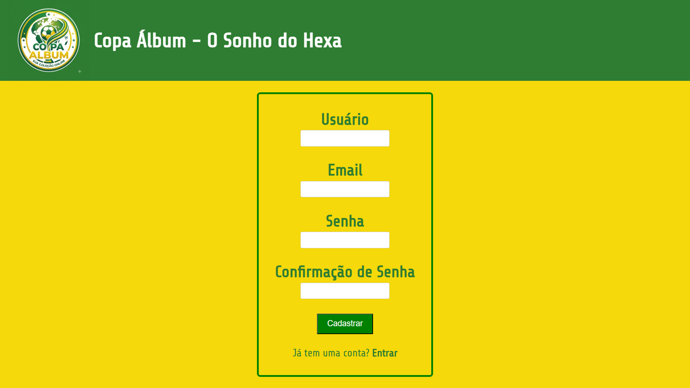
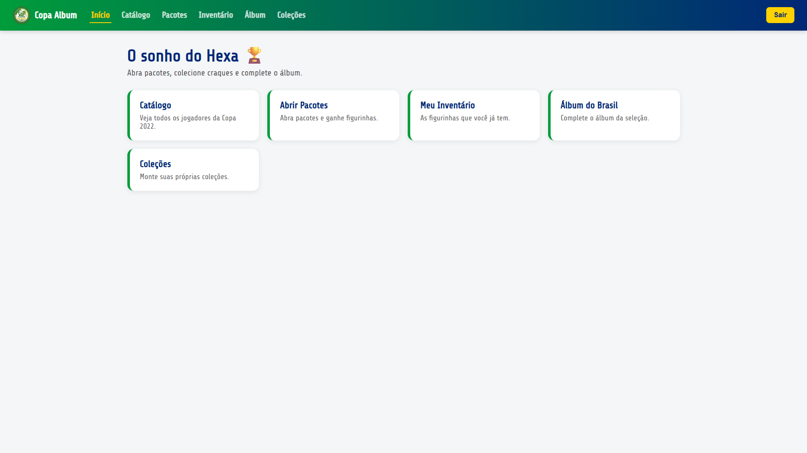
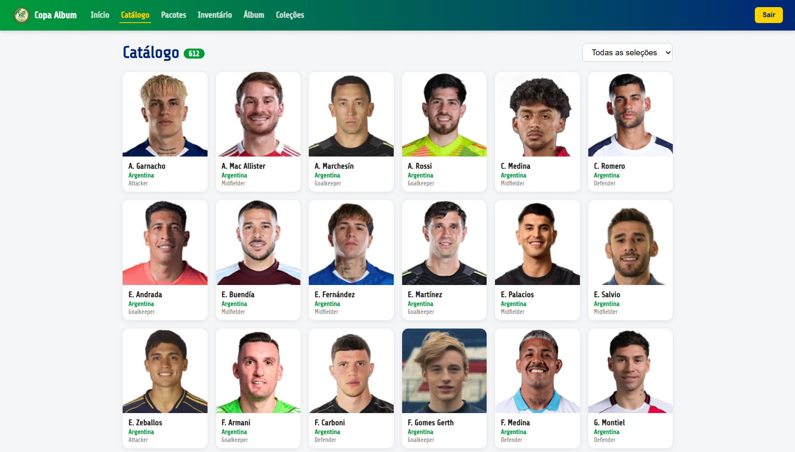
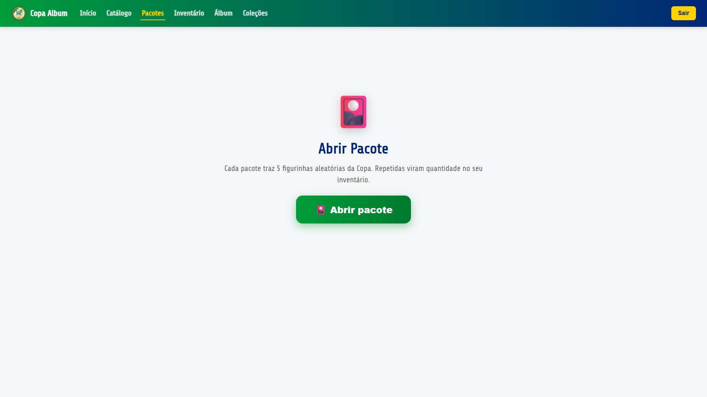
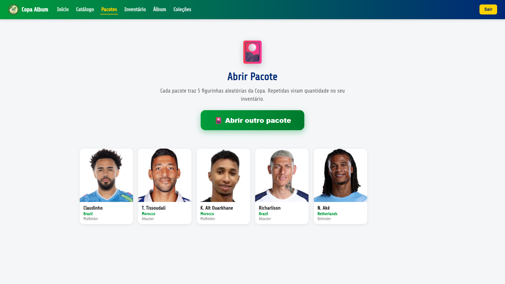
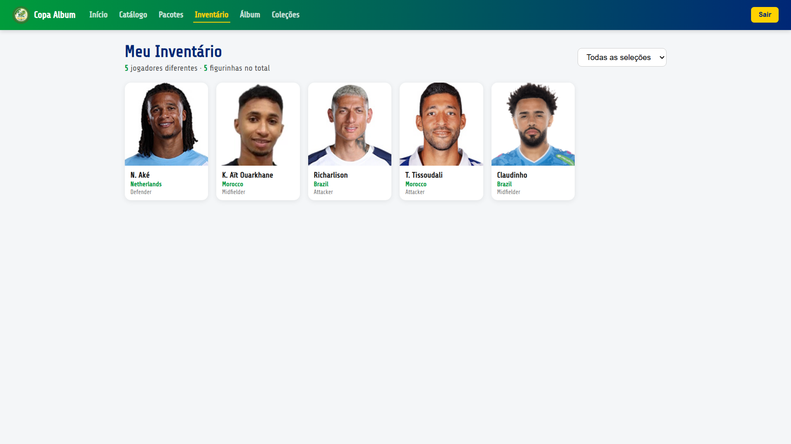
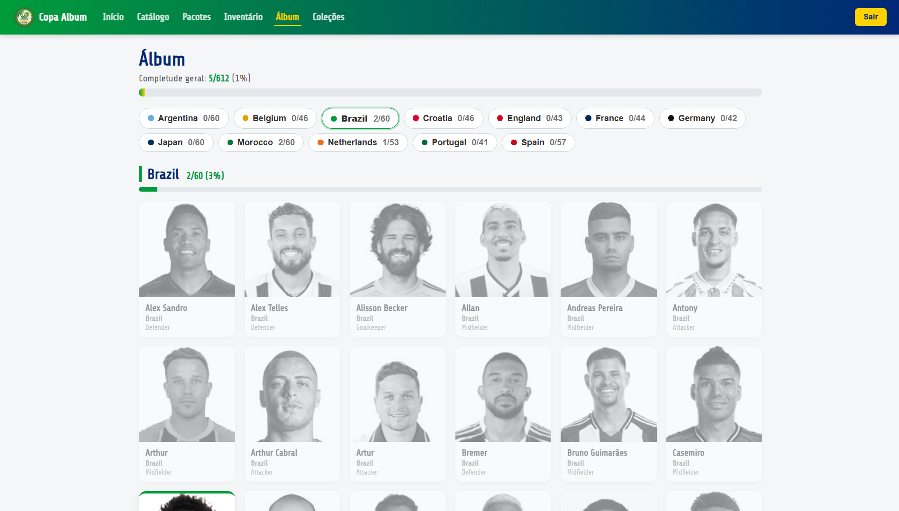
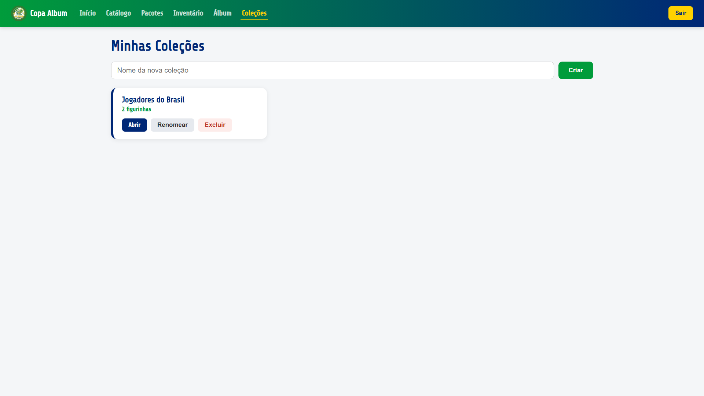
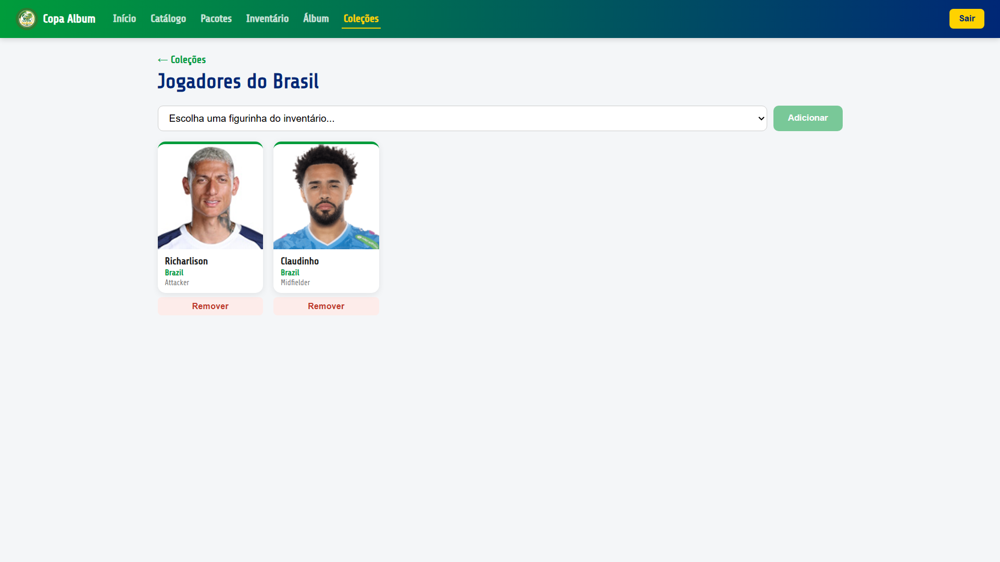

# Copa Álbum — O Sonho do Hexa ⚽

## Descrição do Projeto

O **Copa Álbum — O Sonho do Hexa** é um projeto inspirado em álbuns de figurinhas da Copa do Mundo. A aplicação permite que usuários criem conta, façam login, visualizem seu inventário de figurinhas, acompanhem o progresso do álbum e criem coleções personalizadas com as figurinhas da Seleção Brasileira que possuem.

A proposta do projeto é simular um álbum de figurinhas, permitindo que cada usuário tenha seu próprio inventário e organize suas figurinhas em coleções temáticas, como favoritos, jogadores de uma determinada posição (como atacantes, zagueiros...), entre outras possibilidades.

As principais funcionalidades da aplicação são:

- Cadastro e login de usuários;
- Campos `E-mail` e `Usuário` são únicos no cadastro;
- Validação de cadastro e login;
- Autenticação com JWT;
- Rotas privadas para usuários autenticados;
- Abertura de pacotes de figurinhas;
- Listagem do inventário do usuário;
- Visualização do álbum da Seleção Brasileira;
- Cálculo de completude do álbum;
- CRUD completo de coleções;
- Adição e remoção de figurinhas em coleções personalizadas;
- Integração com API externa para dados relacionados a jogadores.

## Tecnologias Utilizadas

### Frontend

- React
- Vite
- TypeScript
- React Router DOM
- Axios
- Zod

### Backend

- Node.js
- Express
- TypeScript
- Prisma ORM
- SQLite
- JWT
- Bcrypt
- Zod

## Screenshots da Aplicação

### Tela de Login

### Tela de Cadastro

### Tela de Início

### Tela de Catálogo

### Tela de Abrir Pacote

### Tela de Pacote Aberto

### Tela de Inventário

### Tela de Álbum

### Tela de Coleções

### Tela de Coleção Aberta

## Integrantes

| Nome | GitHub |
|---|---|
| Renan Morais | [@renanmoraiss](https://github.com/renanmoraiss) |
| João Pedro Sabino | [@sabjoao](https://github.com/sabjoao) |
| Matheus Dourado | [@mvtheusdourado](https://github.com/mvtheusdourado) |